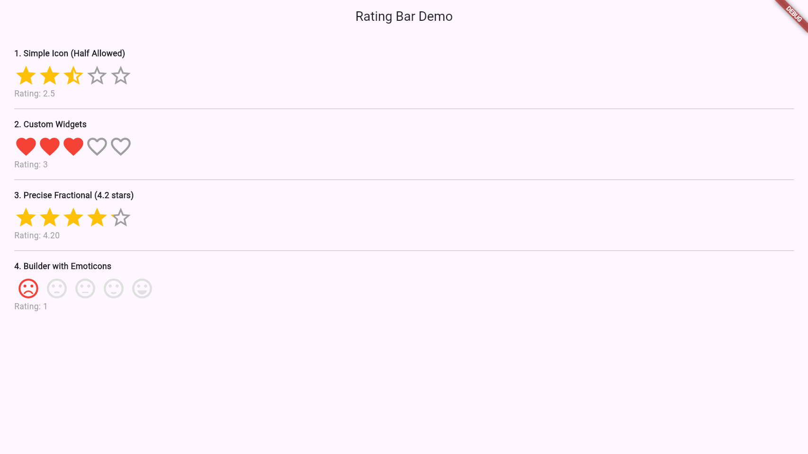

# rating_bar

A highly customizable and precise Rating Bar for Flutter, designed for modern Dart and Flutter versions.

## Features

- **Precise Fractional Ratings:** Supports precise fractional values like 4.2 or 3.7.
- **RTL Support:** Fully supports Right-to-Left layouts.
- **Custom Item Builders:** Build complex rating bars using SVGs, varied icons per rating level (e.g., emojis), or generic widgets.
- **Half-Star Support:** Snap to half or full stars if desired.
- **Gestures:** Handles dragging, tapping, and swipe gestures to easily select values.
- **Modern:** Fully updated for Dart 3 and Flutter 3 with strict null safety.

## Screenshots



## Usage

Check out the `example/` folder for a complete working app.

```dart
// 1. Simple Icon Rating
RatingBar(
  initialRating: 3.5,
  isHalfAllowed: true,
  filledIcon: Icons.star,
  emptyIcon: Icons.star_border,
  halfFilledIcon: Icons.star_half,
  filledColor: Colors.amber,
  onRatingChanged: (rating) {
    print(rating);
  },
)

// 2. Precise Fractional Rating (Uses Stack + ClipRect)
RatingBar.custom(
  initialRating: 4.2,
  allowFractionalRating: true,
  filledWidget: const Icon(Icons.star, color: Colors.amber, size: 50),
  emptyWidget: const Icon(Icons.star_border, color: Colors.grey, size: 50),
  onRatingChanged: (rating) {
    print(rating);
  },
)

// 3. Custom Item Builder (Varying widgets per index)
RatingBar.builder(
  initialRating: 3.0,
  itemBuilder: (context, index) {
    // Return a RatingWidget with full and empty variants!
    return RatingWidget(
      full: Icon(Icons.sentiment_satisfied, color: Colors.green),
      empty: Icon(Icons.sentiment_satisfied, color: Colors.grey),
    );
  },
  onRatingChanged: (rating) {
    print(rating);
  },
)
```
